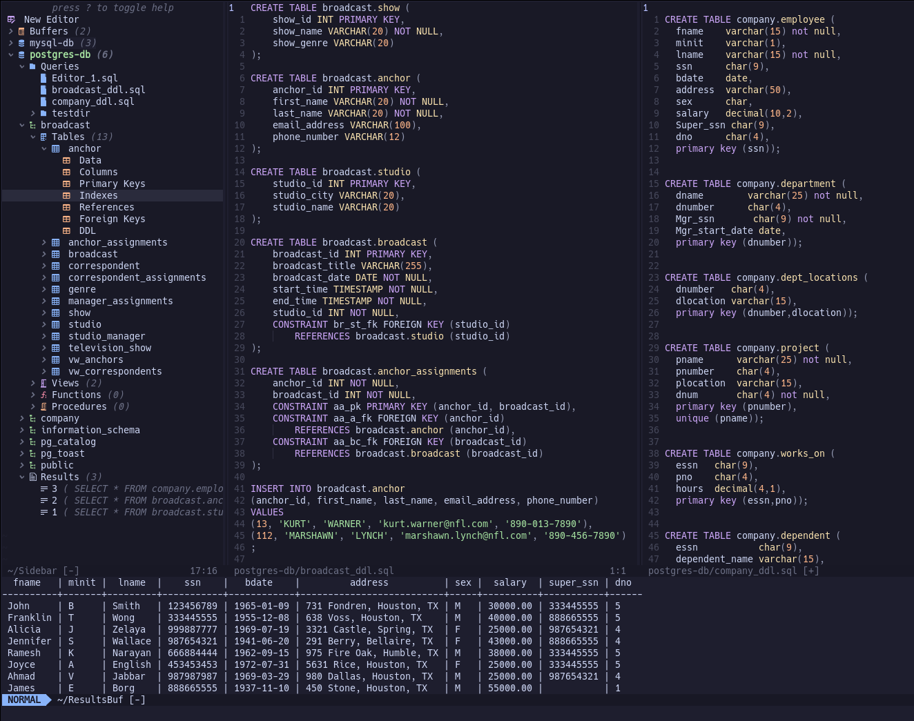

# SQLua.nvim

A Modern SQL UI for NeoVim written in Lua emphasizing speed and simplicity, turning NeoVim into a full-fledged SQL IDE.



Currently supported DBMS:
* PostgreSQL
* MySQL

## Installation

### Lazy

```lua
{
    'xemptuous/sqlua.nvim',
    lazy = true,
    cmd = 'SQLua',
    config = function() require('sqlua').setup() end
}
```
### vim-plug

```lua
Plug 'xemptuous/sqlua.nvim'
```

### Packer
```lua
use "xemptuous/sqlua.nvim"
```

To launch SQLua quickly, consider adding an alias to your `.zshrc` or `.bashrc`
```
alias nvsql="nvim '+SQLua'"
```

## Setup

To use, require the setup:
`:lua require('sqlua').setup(opts)`

After the first time running the setup() function, a folder for SQLua will be created in the neovim data directory (~/.local/share/nvim/sqlua/)

The `connections.json` file here will contain your DB URL's, as well as friendly names to call them by.

You can override the default settings by feeding the table as a table to the setup() function:
```lua
{
    db_save_location = "~/.local/share/nvim/sqlua/dbs",
    connections_save_location = "~/.local/share/nvim/sqlua/connections.json"
    default_limit = 200, -- Not currently implemented
    keybinds = {
        execute_query = "<leader>r",
        activate_db = "<C-a>"
    }
}
```

## Usage:

Current commands include:
```
:SQLua <dbname(s)> - launches the SQLua UI with the listed DB's
:SQLuaExecute - (executed by keybind in buffer) executes the buffer (in normal mode) or selection (in a visual mode)
:SQLuaAddConnection - prompts the user to add a connection to the connections file
```

The sidebar navigator can be used to explore the DB and its various schema and tables, as well as creating various template queries.

### Executing Queries
The editor buffer(s) are used to run queries.

By default, the keymap to execute commands is set to `<leader>r`, acting differently based on mode:

<pre>
    <kdb>&lt;leader>r</kbd> (normal mode): Runs the entire buffer as a query.
    <kdb>&lt;leader>r</kbd> (visual mode): Runs the selected lines as a query. (visual, visual block, and/or visual line)
</pre>

Upon executing a query, the results will be shown in a results buffer.

The DB used will be highlighted and set to the "active" DB. Using the `activate_db` keybind will change which DB is considered the active one for each query.

Note, template DDL statements do not need to set the active DB; i.e., they will always
be run based on the parent table, schema, and database.

## Roadmap

This project is actively being developed, and will hopefully serve as NeoVim's full-fledged SQL IDE moving forward, eliminating the need for long load times and multiple vim extensions.

- [x] Create functional connection for psql
- [x] Be able to execute queries from buffer
- [x] Create a minimal UI structure
- [x] Make a functional NvimTree-sidebar for navigating the DB
- [x] Implement multiple db's available in sidebar at once (easily jumping between them)
- [x] Implement queries, ddl, and other template queries into the sidebar tree.
- [x] Create asynchronous jobs for queries and connections.
- [x] Create db-specific sql files to be stored in sqlua/dbs/<dbname> folder
- [ ] Implement Nvim-Tree QoL features into sidebar
- [ ] Add DB Inspection + nvim-cmp completions
- [ ] Implement active connection variables to be set for the connections' lifetimes
- [ ] Add default limit functionality
- [ ] Add an option for "fancier" results pane output
- [ ] Implement syntax highlighting for dbout similar to other SQL IDE's (datetime, numbers, strings, null, etc.)
- [ ] Include fancy ui functionality to make SQLua sexy
